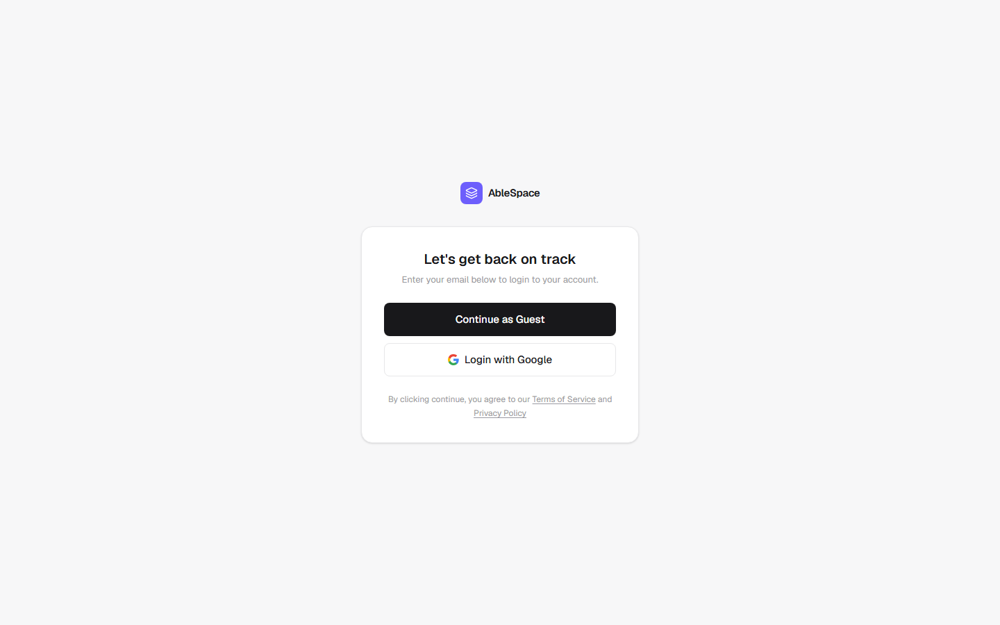
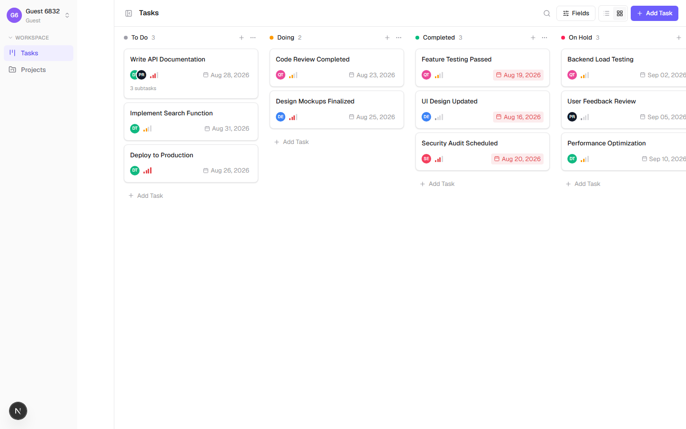
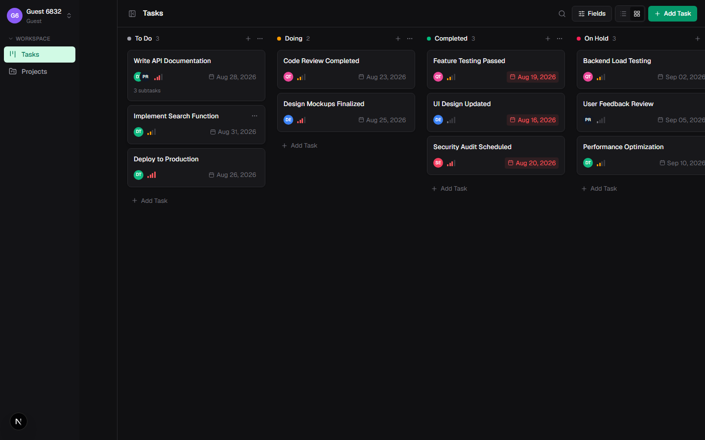
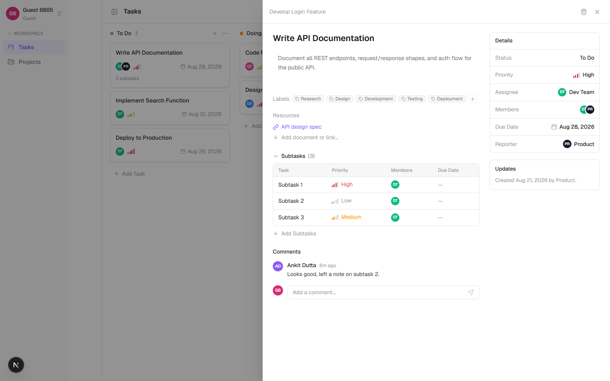
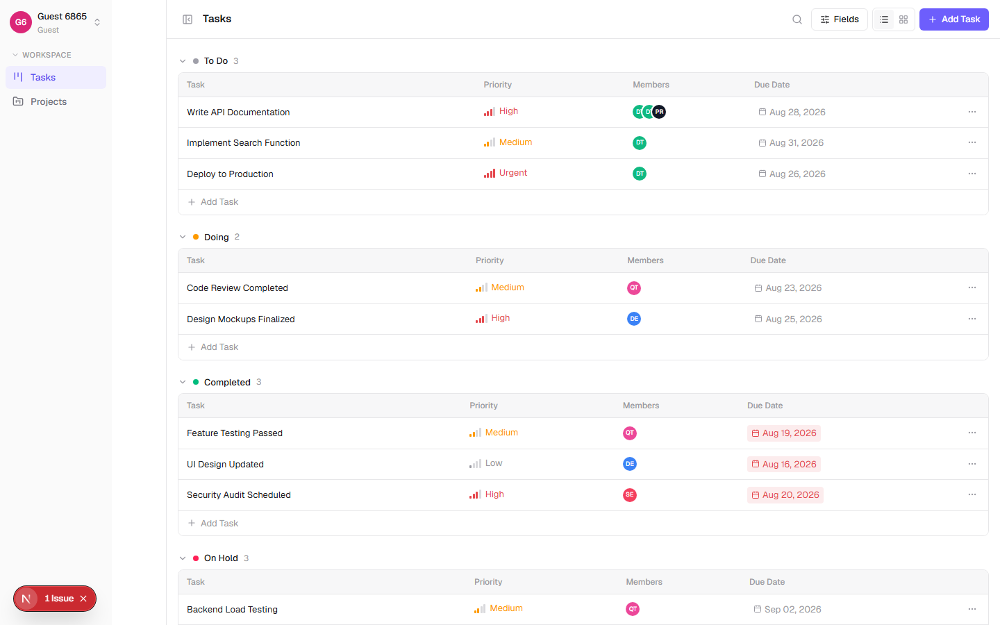
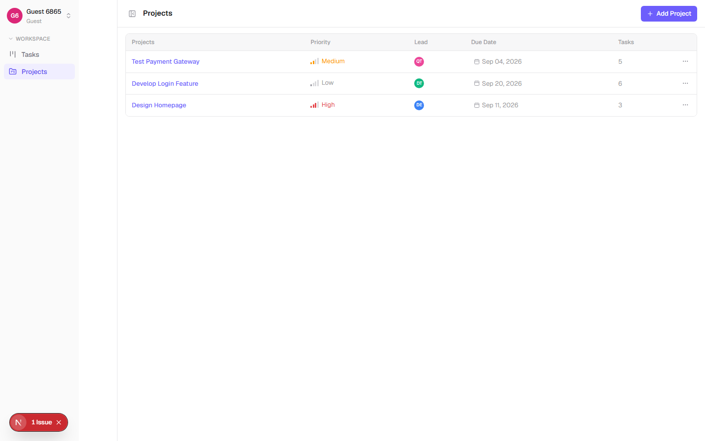
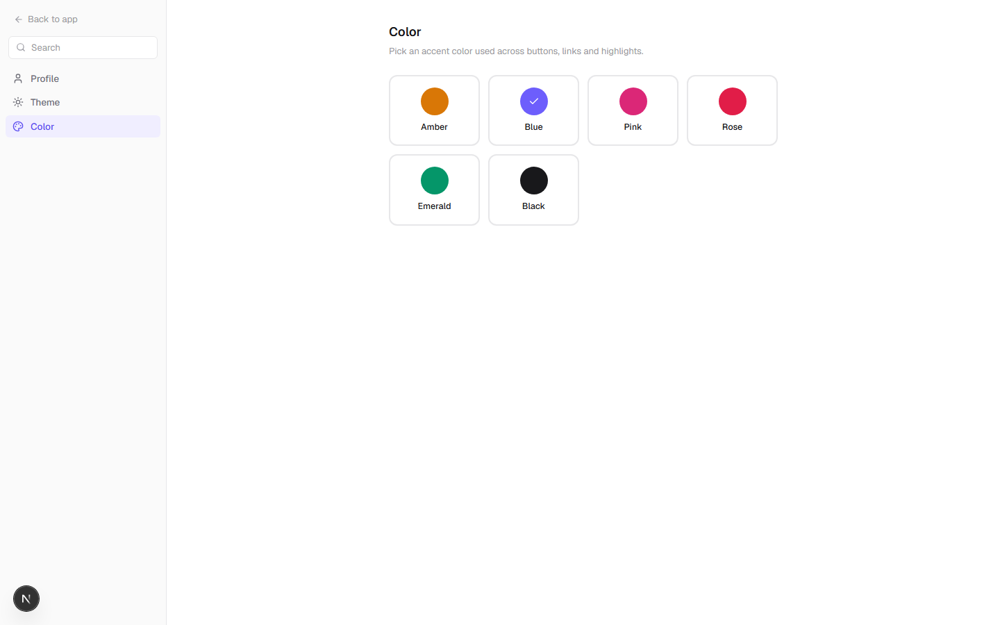
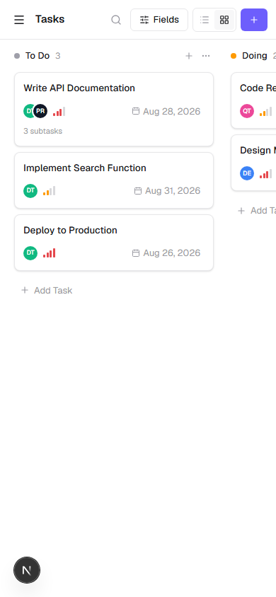

# AbleSpace — Task Management System

A Linear/ClickUp-style task management app built for the AbleSpace Full Stack
Developer (Fresher) technical assessment. Implements the provided Figma design
(guest + Google login, theme/color customization, kanban + list task views,
task detail with subtasks/comments/resources, projects) end-to-end with a
Next.js frontend and a NestJS API.

- **Live app:** _add your deployed frontend URL here after deploying_
- **Live API:** _add your deployed backend URL here after deploying_
- **Part 2 (Product Understanding):** [docs/part2-product-understanding.md](docs/part2-product-understanding.md)

## Tech stack

| Layer | Choice |
|---|---|
| Frontend | Next.js 16 (App Router), TypeScript, Tailwind CSS v4 |
| Backend | NestJS (TypeScript), class-validator DTOs |
| Database | SQLite via Prisma ORM (swap one line for Postgres in production, see [backend/README.md](backend/README.md)) |
| Auth | JWT (guest login + optional Google OAuth) |
| State/data | SWR (server cache), Zustand (local UI state), next-themes |
| Drag & drop | @dnd-kit |

Two independent projects in one repo:

```
ablespace-task-manager/
  frontend/   Next.js app          → see frontend/README.md (create-next-app default docs)
  backend/    NestJS API + Prisma  → see backend/README.md for full endpoint list
  docs/       Part 2 write-up + design-QA screenshots
```

## Screenshots

| | |
|---|---|
|  |  |
|  |  |
|  |  |
|  |  |

## Running it locally

Two terminals, backend first:

```bash
# 1) Backend — http://localhost:4000/api
cd backend
npm install
cp .env.example .env
npx prisma migrate dev   # creates prisma/dev.db
npm run seed             # demo users, projects, tasks, labels
npm run start:dev

# 2) Frontend — http://localhost:3000
cd frontend
npm install
cp .env.local.example .env.local   # NEXT_PUBLIC_API_URL=http://localhost:4000
npm run dev
```

Open `http://localhost:3000`, click **Continue as Guest**, and you're in — no
account setup required. Guest sessions are fully functional (create/edit/move
tasks, projects, comments, subtasks, theme/color, profile).

### Google login (optional)

Guest login covers the full app. If you want **Login with Google** to work
too, register an OAuth 2.0 Client ID in the
[Google Cloud Console](https://console.cloud.google.com/apis/credentials),
add `http://localhost:4000/api/auth/google/callback` as an authorized
redirect URI, and set `GOOGLE_CLIENT_ID` / `GOOGLE_CLIENT_SECRET` in
`backend/.env`. Without those variables the button is still shown (matching
the Figma design) but the backend responds with a clean, non-crashing 501
explaining Google login isn't configured — the app boots fine either way.

## Feature checklist against the assignment

- ✅ **Guest login** — `POST /api/auth/guest`, one click, no form
- ✅ **Google login** — implemented server + client side, optional at deploy time (see above)
- ✅ **Theme support** — Light/Dark, and a separate 6-way accent **Color Mode**
  (Amber/Blue/Pink/Rose/Emerald/Black), exactly as in the Figma account menu
  and the dedicated Settings → Theme / Settings → Color screens. Both persist
  in `localStorage` for instant reload with no flash of unstyled theme, *and*
  sync to the user's account (`PATCH /api/users/me/preferences`) so the
  preference also follows a Google-authenticated user across devices.
- ✅ **Tasks** — kanban board (drag-and-drop between/within columns) and a
  grouped list view, toggle between them, matching the Fields-menu-driven
  column visibility (Priority/Members/Due Date/Labels/Status/Reporter) seen
  in the Figma comments, plus a Filter menu (by priority/labels) matching the
  filter icon visible in the Figma toolbar next to Fields
- ✅ **Projects toolbar parity** — the Figma shows the same Fields + Filter
  controls on the Projects screen as on Tasks; an earlier pass only wired
  these up for Tasks, caught and fixed during a full re-verification pass
  against the Figma screenshots (see "Bugs found and fixed" below)
- ✅ **Task detail** — title/description editing, Properties, Labels,
  Resources, Subtasks table with inline add, Comments thread — laid out as a
  right-hand slide-over exactly like the Figma detail screens, with a
  Details sidebar (Status/Priority/Assignee/Members/Due Date/Reporter)
- ✅ **Projects** — list + per-project scoped task board/list, matching the
  Projects table (Priority/Lead/Due Date/Task count) from the Figma
- ✅ **Profile settings** — full name/title/username, "Leave Workspace"
- ✅ **Reusable components** — `ui/` primitives (Button, Input, Avatar,
  Dropdown, Dialog, PriorityBadge, LabelPill, DueDateBadge) reused across
  every screen; task/project cards, tables, and dialogs are all composed
  from the same building blocks
- ✅ **NestJS API** — thin controllers, service-layer logic, DTOs validated
  with `class-validator` + a global `whitelist`/`forbidNonWhitelisted`
  pipe, consistent 404s/400s, Swagger docs at `/api/docs`
- ✅ **Responsive design** — collapsible/overlay sidebar on mobile, kanban
  scrolls horizontally, list view collapses columns by breakpoint, task
  detail becomes full-screen below `lg`. See `docs/screenshots/08-*` and
  `09-*` for mobile captures.

## Bugs found and fixed during QA

After the initial build, every screen was re-verified against the Figma
screenshots and driven end-to-end with Playwright (desktop/tablet/mobile,
light/dark, all six accent colors, every CRUD path, drag-and-drop, filters).
That pass caught and fixed several real issues rather than just cosmetic
ones — listed here instead of quietly folded into the diff, since knowing
what was actually broken is more useful than a bare "it works":

- **Guest logins were permanently polluting every assignee picker** (the
  most serious one). Seed "team member" users were mistakenly flagged
  `isGuest: true`; once `GET /api/users` was fixed to exclude guests (so a
  "Continue as Guest" click doesn't itself become a forever-visible
  assignee), the same flag on the seed data hid the real team roster too.
  Fixed at the source (`isGuest: false` on seed users) with a regression
  test (`test/app.e2e-spec.ts`) asserting guests never appear in the picker.
- **Multi-select dropdowns closed after a single click** — Fields, Filter,
  and the task detail's Members picker all use checkbox items, but Radix
  closes a dropdown on any select by default. Toggling a second field/label/
  member required reopening the menu each time. Fixed once at the shared
  `DropdownMenuCheckboxItem` component.
- **The Filter menu closed itself when hovering toward its own submenu** —
  a genuine Radix positioning bug: when a submenu is forced to flip open on
  its left side (which happens when the trigger sits near the right edge of
  the toolbar, as Filter does), Radix's hover "safe area" tracking breaks
  and the submenu unmounts before a click can land. Confirmed with a
  MutationObserver + forced clicks, then fixed by flattening Filter into a
  single-level list instead of a nested submenu (also simpler to use).
- **The kanban column's `⋯` button did nothing** — a leftover from the
  Figma layout with no wired action; removed rather than left as a dead
  click target.
- **The task card's `⋯` action menu was invisible on touch devices** — it
  only appeared on `:hover`, which doesn't exist on mobile/tablet. Fixed
  with a `pointer-coarse:` variant so it's always visible on touch, plus
  `focus-within` for keyboard users.
- **~10 icon-only buttons had no accessible name** (search toggle, close,
  delete, sidebar hamburger, `⋯` menus, dialog close) — added `aria-label`s
  throughout, plus distinct landmark labels for the desktop vs. mobile
  sidebar (previously both were unlabeled `<aside>` regions with identical
  content, which is confusing for screen reader users).
- **Projects page was missing Fields/Filter/Search** that the Figma clearly
  shows in its toolbar — added, matching the Tasks page pattern.

## Design fidelity notes / intentional deviations

The Figma file was reviewed as static screenshots (view-only access, several
in-progress comment threads visible from other reviewers) rather than an
editable/inspectable file, so exact hex values, font metrics, and some
interaction micro-details were reconstructed by eye rather than copied from
Figma's inspector. Everything below is a deliberate, documented choice made
to keep the scope shippable as a fresher assessment, not an oversight:

1. **Auth token transport** — the JWT is returned in the response body and
   stored in `localStorage`, not an httpOnly cookie. The frontend and backend
   are deployed on different domains (Vercel + Render/Fly), and cross-site
   `SameSite=None` cookies are fragile across free-tier hosts; a bearer token
   is simpler and just as workable for an assessment project. A production
   version handling real user data would use httpOnly cookies + refresh
   tokens instead.
2. **"Workspace"** in the sidebar is displayed as in the Figma (workspace
   name, switcher chevron) but isn't a full multi-tenant workspace model —
   every user's tasks/projects live in one shared demo workspace. Building
   real multi-workspace isolation was out of scope for the visible screens.
3. **Activity feed** — the Figma detail view's "Updates" panel (shown mid-way
   through an edit, e.g. "changed priority from No priority to Urgent") is
   implemented as a lightweight created/last-updated summary rather than a
   full per-field audit log, to keep the data model focused on the features
   that are actually interactive in the provided screens.
4. **Drag-and-drop** uses `@dnd-kit` rather than a Figma-specified library
   (Figma doesn't specify one); column reordering and cross-column drag both
   update `status`/`order` optimistically against the API.
5. A few labels/members/dates that were cut off or unreadable in the
   low-resolution Figma screenshots (e.g. exact seed due dates) were filled
   in with reasonable placeholder values rather than guessed pixel-for-pixel.
6. **List/Board toggle placement** — the Figma nests the List/Board switch
   inside the Fields dropdown; this build surfaces it as its own
   always-visible segmented control next to Fields instead, so switching
   views doesn't require opening a menu first. Same capability, one click
   fewer, everything else about that Fields menu matches.
7. **Assignable roster excludes guest sessions by design** — "members" you
   can assign a task/project to are the fixed seeded team (Admin, Designer,
   Dev Team, Product, QA Team, Security, Ankit Dutta), not every visitor who
   has clicked "Continue as Guest". A guest can fully use the app (create,
   edit, comment) but isn't themselves assignable, the same way a demo
   visitor isn't added to a real team roster. See "Bugs found and fixed".

## Deployment

This repo is deploy-ready but was not deployed by the AI assistant that built
it — that step needs the assessment candidate's own GitHub/Vercel/Render
accounts, which weren't available in this environment. Recommended path:

1. **Backend → Render** (or Fly/Railway): `render.yaml` at the repo root is a
   ready-to-use Blueprint (`Dockerfile` in `backend/`, persistent disk for
   the SQLite file). Set `FRONTEND_ORIGIN` to your deployed frontend URL
   after step 2.
2. **Frontend → Vercel**: import the repo, set the project root to
   `frontend/`, add `NEXT_PUBLIC_API_URL=<your backend URL>` as an
   environment variable, deploy.
3. Update `FRONTEND_ORIGIN` on the backend to the final Vercel URL (CORS) and
   redeploy the backend.
4. Fill in the **Live app** / **Live API** links at the top of this file.

## Part 1 vs Part 2

- Part 1 (this README + `frontend/` + `backend/`) is the implementation.
- Part 2 is a written product walkthrough of AbleSpace's own Caseload → Take
  Data screen, based on the screenshot provided in the assessment PDF — see
  [docs/part2-product-understanding.md](docs/part2-product-understanding.md).
